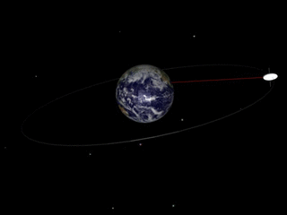

# TwoBody-Orbit-Simulator-Using-RK4

This repository contains a Python-based orbital dynamics simulator that models the motion of two bodies under gravitational influence using the Runge-Kutta 4th order (RK4) method. The simulator enables the exploration and visualization of various two-body systems, such as planets and their moons, satellites around celestial bodies, or spacecraft in orbital trajectories.

## Features

- **Two-Body Dynamics**: Simulate the motion of two bodies under gravitational attraction, accounting for their masses and initial conditions.
- **RK4 Integration**: Utilize the Runge-Kutta 4th order numerical integration method for accurate and stable trajectory calculations.
- **Animated Visualization**: Visualize the orbits of the bodies with animated plots, providing insight into their dynamic behavior over time.
- **Data Output**: Output position and time data at each simulation step for further analysis and processing.



### Prerequisites

- Python 3.x
- Required Python packages: `numpy`, `matplotlib`

Install the required packages using pip:

```bash
pip install numpy matplotlib
```

## Running the Simulation
- Clone the Repository:
```bash
git clone https://github.com/your-username/TwoBody-Orbit-Simulator-Using-RK4.git
cd TwoBody-Orbit-Simulator-Using-RK4
```
## Run the script
```bash
python main.py
```
## Enter Initial Conditions: When prompted, enter the initial position (x, y in meters), velocity (x, y in meters/second), and the initial time (in seconds).
```bash
Enter the initial x position (in meters): 384400000
Enter the initial y position (in meters): 0
Enter the initial x velocity (in meters/second): 0
Enter the initial y velocity (in meters/second): 800
Enter the initial time (in seconds): 0
```
## Output

- The script saves the output data (time, x, y) to `orbit_output.txt` and `orbit_output_dynamic.txt`.
- An animated plot shows the trajectory of the orbiting body.

## Resources

 `[https://en.wikipedia.org/wiki/Runge%E2%80%93Kutta_methods](URL)`Runge-Kutta methods - Overview of Runge-Kutta numerical integration methods.
Orbital Mechanics - Fundamental principles of orbital mechanics.
Python Numpy Library - Essential package for scientific computing with Python.
Matplotlib - Comprehensive library for creating static, animated, and interactive visualizations in Python.


 


